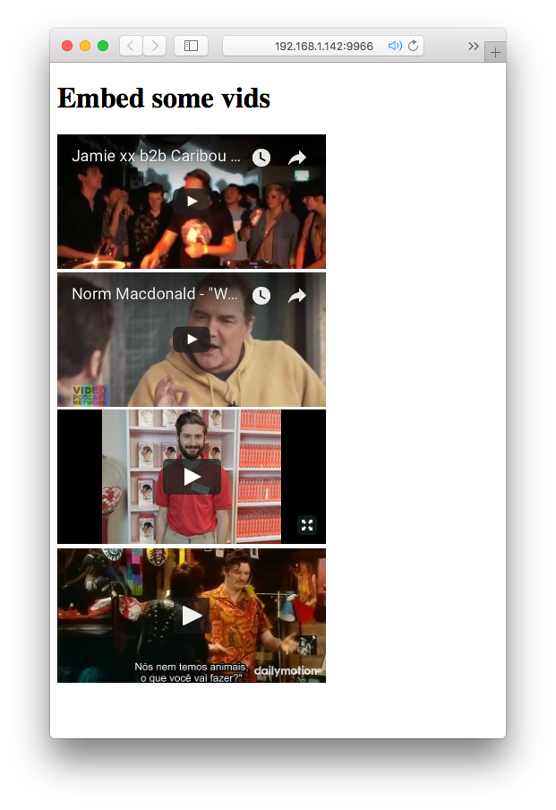

# youtube-component [![stability][0]][1]
[![npm version][2]][3] [![build status][4]][5]
[![downloads][8]][9] [![js-standard-style][10]][11]

A native DOM component wrapper for embedded videso from sites like youtube.



## Usage

```js
// Vanilla JS example
var YoutubeComponent = require('youtube-component')

var video1 = new YoutubeComponent()
var video2 = new YoutubeComponent()

document.body.appendChild(video1.render('https://www.youtube.com/watch?v=jnGtXnpZYDY&t=910s'))
document.body.appendChild(video2.render('https://www.youtube.com/watch?v=iK6t9mJCykw'))

```

## Installation
```sh
$ npm install youtube-component
```
## API
### `YoutubeComponent = require('youtube-component`)
Import `YoutubeComponent` component class.

### `video = new YoutubeComponent([opts])`
Create an instance of a video component.  Options are passed directly to [embed-video][ev].  See that module for full API reference.

```js
{
  query: { // ANY
    portrait: 0,
    color: '333'
  },
  attr: { // ANY
    width:400,
    height:200
  },
  placeholder: true // Disable placeholder text
}
```

### `video.render(videoURL)`
Returns an iframe if not mounted, otherwise returns a proxy element.  See [nanocomponent][nc] for more information on native DOM component API details.  Video embedding powered by [embed-video][ev] 👏.  If a bad or unsupported URL is passed in, a placeholder text will appear.

Native DOM component model powered by [nanocomponent][nc] and [nanomorph][nm].

## License
[MIT](https://tldrlegal.com/license/mit-license)

[0]: https://img.shields.io/badge/stability-experimental-orange.svg?style=flat-square
[1]: https://nodejs.org/api/documentation.html#documentation_stability_index
[2]: https://img.shields.io/npm/v/youtube-component.svg?style=flat-square
[3]: https://npmjs.org/package/youtube-component
[4]: https://img.shields.io/travis/bcomnes/youtube-component/master.svg?style=flat-square
[5]: https://travis-ci.org/bcomnes/youtube-component
[8]: http://img.shields.io/npm/dm/youtube-component.svg?style=flat-square
[9]: https://npmjs.org/package/youtube-component
[10]: https://img.shields.io/badge/code%20style-standard-brightgreen.svg?style=flat-square
[11]: https://github.com/feross/standard
[bel]: https://github.com/shama/bel
[yoyoify]: https://github.com/shama/yo-yoify
[md]: https://github.com/patrick-steele-idem/morphdom
[210]: https://github.com/patrick-steele-idem/morphdom/pull/81
[nm]: https://github.com/yoshuawuyts/nanomorph
[ce]: https://github.com/yoshuawuyts/cache-element
[class]: https://developer.mozilla.org/en-US/docs/Web/JavaScript/Reference/Classes
[isSameNode]: https://github.com/choojs/nanomorph#caching-dom-elements
[onload]: https://github.com/shama/on-load
[choo]: https://github.com/choojs/choo
[nca]: https://github.com/choojs/nanocomponent-adapters
[nc]: https://github.com/choojs/nanocomponent
[ev]: https://github.com/alanshaw/embed-video
